# [ Hello I'm Top and Goodbye 👋 ]
Just someone who wanna be Game-Dev and do some software staff that I can.

   
  <table align="center">
    <tr>
      <th>
        
      </th>
      <th>
        
      </th>
    </tr>
  </table>

  
  <table>
    <thead>
      <tr>
        <th>Programming Languages</th>
        <th>Tools</th>
      </tr>
    </thead>
    <tbody>
      <tr>
        <td>
          
        </td>
        <td>
          
        </td>
      </tr>
    </tbody>
  </table>

## I ever do something below:

  <table>
    <thead>
      <tr>
        <th>Project name</th>
        <th>Tools</th>
        <th>Link</th>
      </tr>
    </thead>
    <tbody>
      <tr>
        <td> Gathering text service </td>
        <td>  </td>
        <td> https://github.com/Top-Slayer/Gathering-Text-Service.git </td>
      </tr>
      <tr>
        <td> Mini game Robot workshop </td>
        <td>  </td>
        <td> https://github.com/Top-Slayer/Mini_game_Robot_workshop.git </td>
      </tr>
      <tr>
        <td> Project register into apartment </td>
        <td>  </td>
        <td> https://github.com/Top-Slayer/Mini_game_Robot_workshop.git </td>
      </tr>
    </tbody>
  </table>

